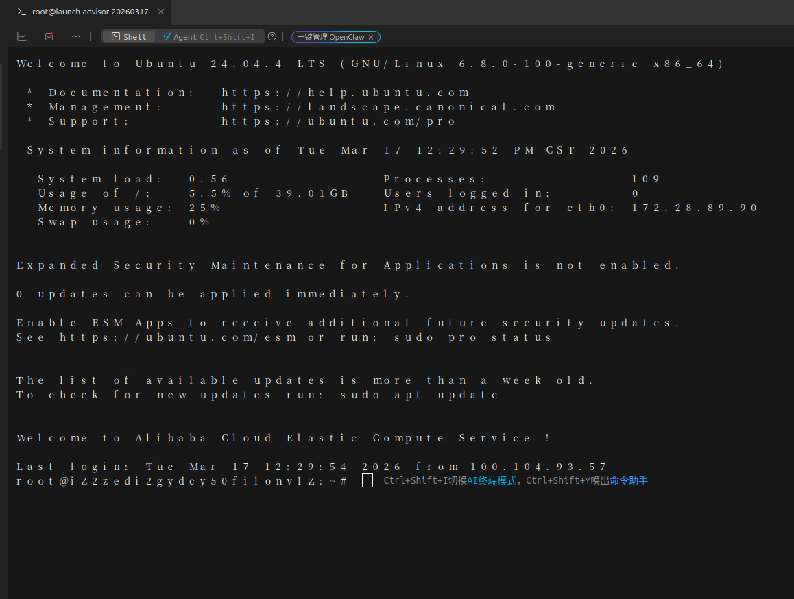
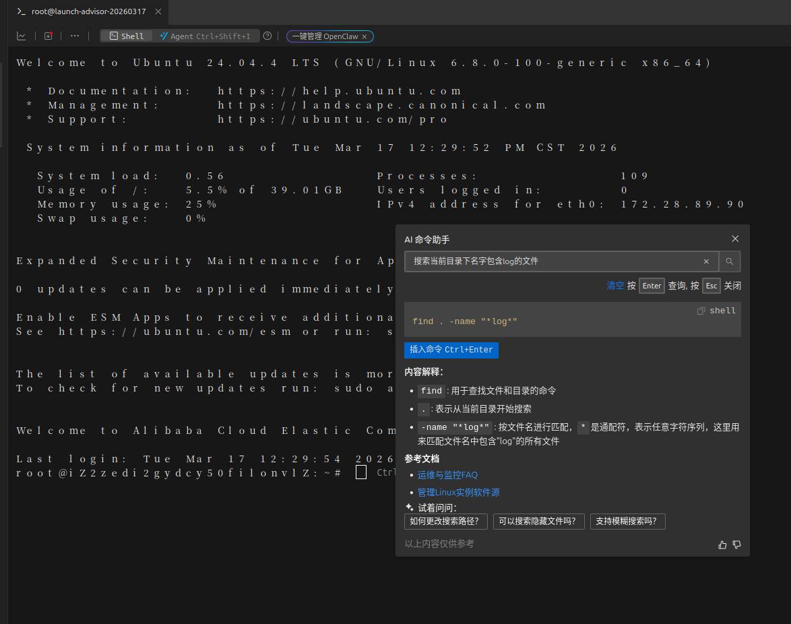
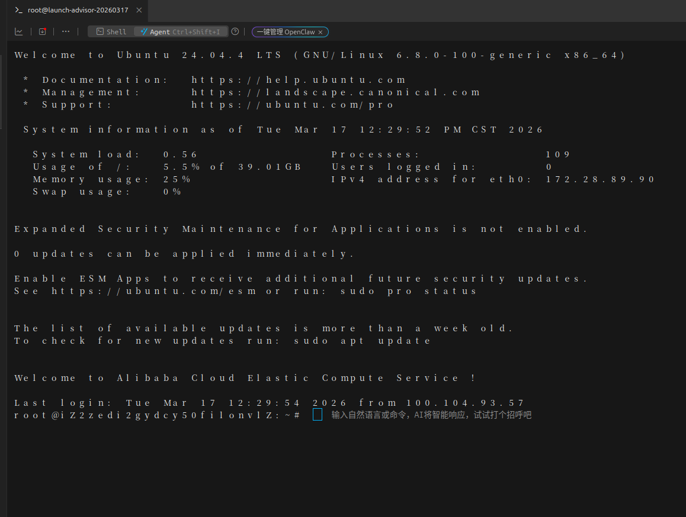
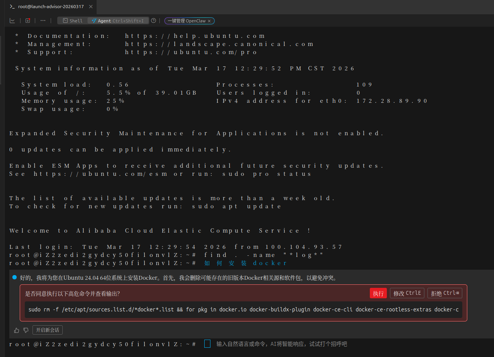
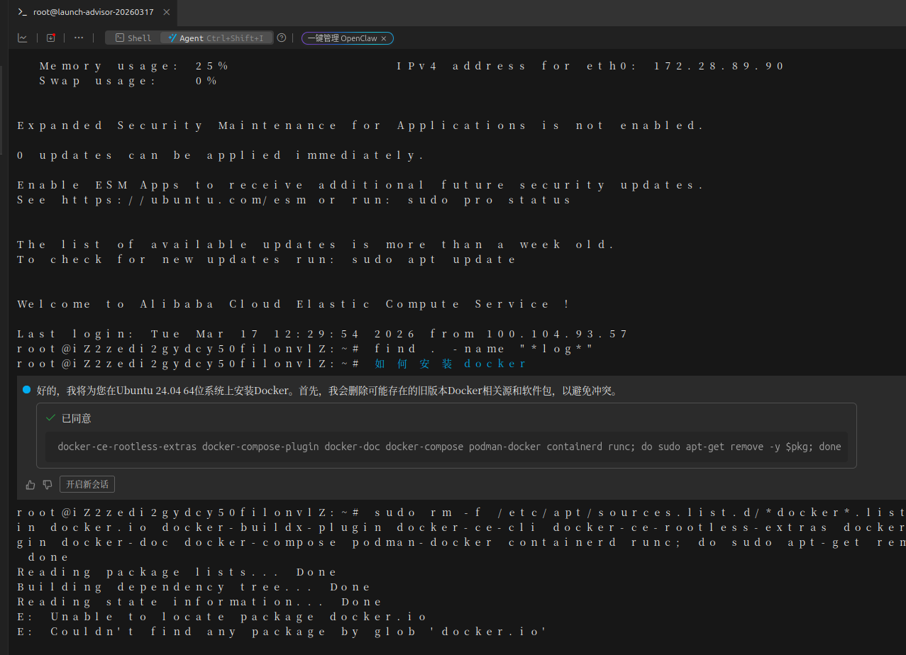
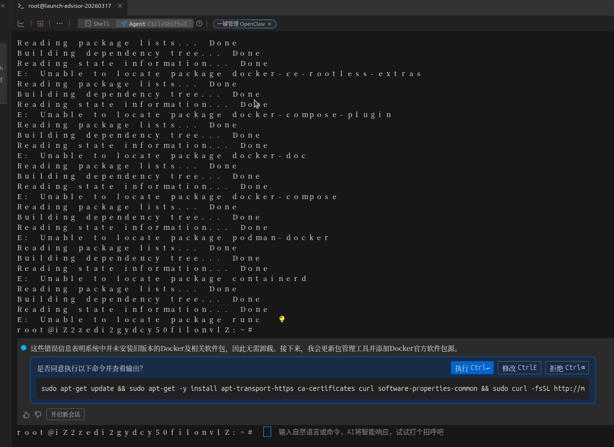
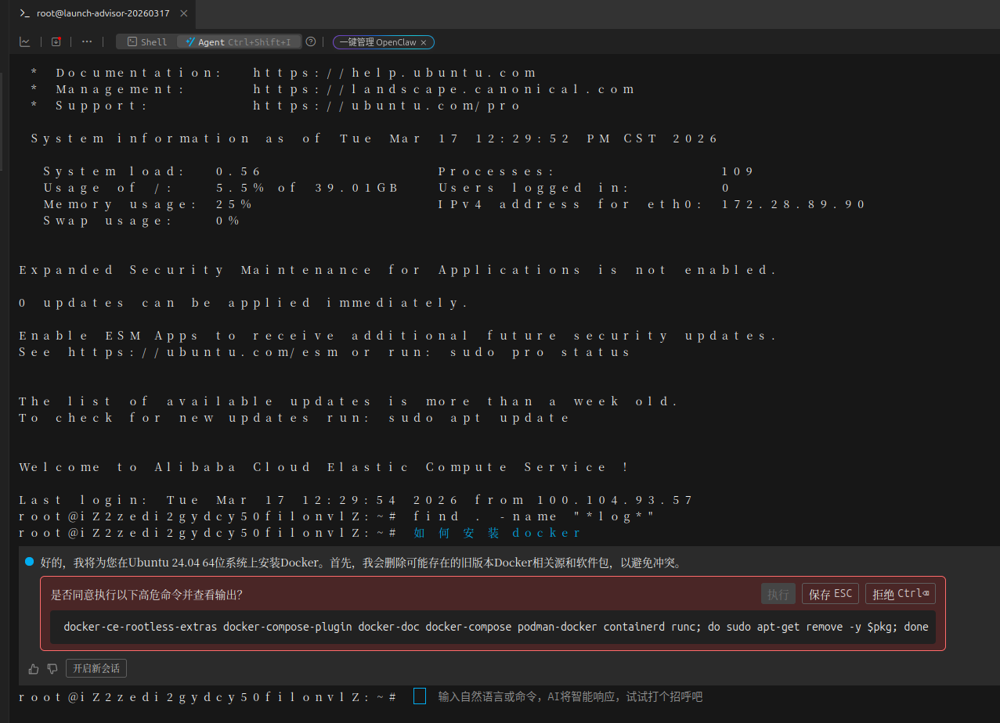

# AI 智能命令交互功能需求理解

---

## 一、核心功能概述

参考阿里云 Workbench 的 AI 命令交互体验，实现三大功能：

1. **shell与agent**
2. **shell功能的ai提示功能**
3. **agent下的ai提示功能**
4. **额外的扩展功能**

---

## 二、功能详细理解

### 2.1 在终端tab页的最右侧显示shell和agent滑动菜单

#### 效果：

**场景描述**：
1. 用户可以通过点击滑动条切换是shell模式还是agent模式
2. 当用户切换到shell模式后，终端只作为shell输出命令
3. 当用户切换到agent模式后，终端输入区域可以输入中文描述，也可以输入命令

---

### 2.2 shell功能的ai提示功能

#### 效果：

**场景描述**：

1. 终端输入命令行默认提示语：“Ctrl+Shift+I切换ai终端模式，Ctrl+Shift+Y唤出命令助手”
2. 命令助手是一个可拖动的悬浮框。
3. 如图：
   - 
   - 
    

**UI 布局**：
```
┌─────────────────────────────────────────────────────────┐
│ 终端区域                                                 │
│ root@server:~$                                          │
│                                                         │
│                        ┌──────────────────────────┐     │
│                        │ 💡 AI 命令建议           │     │
│                        │ ❓ 查看当前目录下最大的... │     │
│                        │           清空 [按enter查询] [按ESC关闭]     │     │
│                        │ ┌───────────────────shell─┐   │     │
│                        │ │ df -h                   │   │     │
│                        │ └──────────────────────── ┘   │     │
│                        │ 插入ctrl+enter           │     │
│                        ├──────────────────────────┤     │
│                        │ 内容解释：                 │     │
│                        │  * du：******            │     │
│                        │  * h：******            │     │
│                        └──────────────────────────┘     │
└─────────────────────────────────────────────────────────┘
```

**状态流转**：
- 用户可以通过点击shell左侧的复制图标复制命令
- 用户可以通过ctrl+enter或者点击插入可以直接把命令输出到命令行输入区，需要用户自己回车执行命令

---

### 2.3 agent功能的ai提示功能

#### 效果：

**场景描述**：

1. 终端输入命令行默认提示语：“输入自然语言或命令，ai将智能响应，试试打个招呼吧” 
2. 在终端输入区域输入命令后，前端将命令发送后端，后端与服务器直接交互得到结果，并将结果直接显示在终端命令行显示区域。
3. 在终端输入区域输入中文描述后，前端将命令发送后端，后端判断为中文描述后发送ai，ai得到结果后直接响应给前端，前端在终端命令行按格式显示 
4. 在终端ai命令显示区域有3个按钮功能，分别是执行，修改和拒绝
   - 执行：前端将命令复制到终端输入区域，原来的ai命令改变状态为已同意。并将命令发送给后端，后端执行命令，并将结果返回给前端在终端显示区域显示，前端在终端显示区域输入回车符，再次把显示结果和上一个中文描述发送给ai，ai继续下一步的指令
   - 修改：用户可以修改命令，直接在ai输出的命令行里修改命令， 命令修改完后可以进行保存和取消操作，这两个操作都会回到执行，修改，拒绝的操作
   - 拒绝：用户可以拒绝此次命名，用户拒绝命令一般是由命令的安全性考虑的，所以需要把拒绝的操作和用户最开始的中文描述发送给后端，后端发送给ai，让ai换一个命令。状态流转也是在终端输入区域直接回车，把拒绝操作和中文描述发送给ai，得到ai响应后，在终端显示区域显示ai结果
    

**UI 布局**：
```
┌─────────────────────────────────────────────────────────┐
│ 终端区域                                                 │
│ root@server:~$  终端输入区域                             │
│ 终端显示区域                                             │
└─────────────────────────────────────────────────────────┘
```

```
┌────────────────────────────────────────────────────────────┐
│ 终端区域                                                    │
│ root@server:~$  如何安装java                                │
│ ┌────────────────────────────────────────────────────────┐ │
│ │ 好的，我将为您在ubuntu24.04上安装jdk                      │ │
│ │ ┌────────────────────────────────────────────────────┐ │ │
│ │ │ 是否同意以下高危命令并查看输出    [执行] [修改] [拒绝]   │ │ │
│ │ │ ┌────────────────────────────────────────────────┐ │ │ │
│ │ │ | sudo apt remove jdk                            │ │ │ │
│ │ │ └──────────────────────────────────────────── ───┘ │ │ │
│ │ └────────────────────────────────────────────────────┘ │ │
│ │ 开启新会话                                              │ │
│ └───────────────────────────────────────────────────────┘  │
└────────────────────────────────────────────────────────────┘
```

---


### 2.4 额外的扩展功能

#### 效果：

**场景描述**：
1. 用户在终端中手动输入命令（不是中文问题）
2. 当用户输入到一定长度时，AI 实时给出补全建议
3. 类似 IDE 的自动补全功能

**示例**：
```
用户输入: sudo apt

AI 实时显示提示列表:
┌─────────────────────────────────────┐
│ sudo apt update     更新软件包数据库 │
│ sudo apt upgrade    升级所有软件包   │
│ sudo apt install    安装指定软件包   │
│ sudo apt remove     移除软件包       │
└─────────────────────────────────────┘
```

**交互方式**：
- `↑/↓` 键：在提示列表中上下选择
- `Tab` 键：接受当前选中的提示
- `Esc` 键：关闭提示列表

**触发条件**：
- 输入的是英文命令（不是中文问题）
- 输入长度超过 2 个字符
- 防抖 300ms 后发送请求

---
